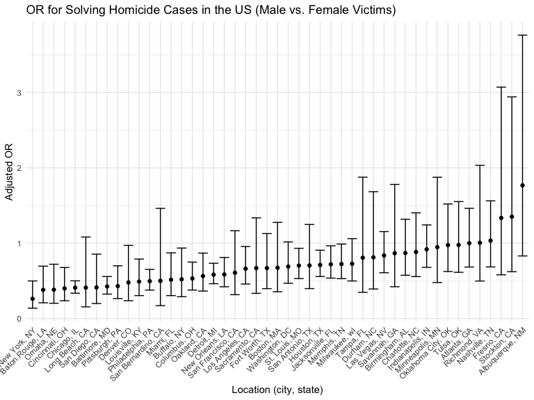
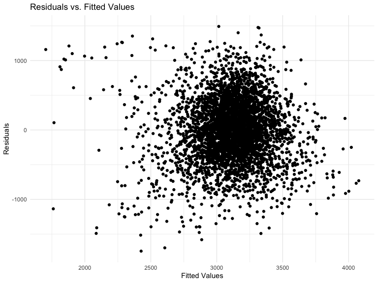
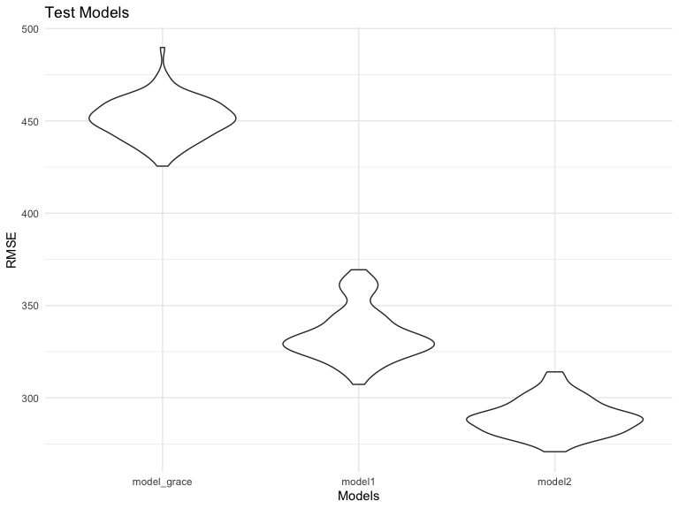

Homework 6
================

# Problem 2

## Load & Clean Data

1.  Load data
2.  Create following variables:
    -   city_state
    -   case_solved: binary variable where 0 = case unresolved, 1 = case
        resolved
3.  Filter the data in the following ways:
    -   For city_state, remove Dallax, TX; Phoenix, AZ; Kansas City, MO;
        Tulsa, AL
    -   For victim_race, only includ White & Black
4.  Convert victim_age’s data type from char to numeric
5.  Skim

``` r
homicide_df = read.csv('data/homicide.csv') %>% 
  janitor::clean_names() %>% 
  mutate(city_state = str_c(city, state, sep = ", "),
         case_solved = as.numeric(case_when(
           disposition == "Closed without arrest" ~ "0",
           disposition == "Open/No arrest" ~ "0",
           disposition == "Closed by arrest" ~ "1"))) %>% 
  filter(city_state != "Dallas, TX", 
         city_state != "Phoenix, AZ", 
         city_state != "Kansas City, MO", 
         city_state != "Tulsa, AL", 
         victim_race %in% c("White" ,"Black")) %>% 
  mutate(victim_age = as.numeric(victim_age))
```

## Baltimore, MD: GLM

1.  Create a new data frame called “baltimore_df”

``` r
homicide_baltimore = homicide_df %>% 
  filter(city_state == "Baltimore, MD")
```

2.  Fit a log reg (outcome = case_solved, predictors = age, sex, race)
3.  Save glm output
4.  Find CI & estimate for odds ratio for male vs. female
    (victim_sexMale row) while keeping all other var

``` r
baltimore_log_fit = 
  homicide_baltimore %>% 
  glm(case_solved ~ victim_age + victim_race + victim_sex, data = ., family = binomial()) 

summary(baltimore_log_fit)
```

    ## 
    ## Call:
    ## glm(formula = case_solved ~ victim_age + victim_race + victim_sex, 
    ##     family = binomial(), data = .)
    ## 
    ## Deviance Residuals: 
    ##     Min       1Q   Median       3Q      Max  
    ## -1.6223  -0.8958  -0.8688   1.4699   1.6579  
    ## 
    ## Coefficients:
    ##                   Estimate Std. Error z value Pr(>|z|)    
    ## (Intercept)       0.309981   0.171295   1.810   0.0704 .  
    ## victim_age       -0.006727   0.003324  -2.024   0.0430 *  
    ## victim_raceWhite  0.841756   0.174716   4.818 1.45e-06 ***
    ## victim_sexMale   -0.854463   0.138176  -6.184 6.26e-10 ***
    ## ---
    ## Signif. codes:  0 '***' 0.001 '**' 0.01 '*' 0.05 '.' 0.1 ' ' 1
    ## 
    ## (Dispersion parameter for binomial family taken to be 1)
    ## 
    ##     Null deviance: 3567.9  on 2752  degrees of freedom
    ## Residual deviance: 3492.7  on 2749  degrees of freedom
    ## AIC: 3500.7
    ## 
    ## Number of Fisher Scoring iterations: 4

``` r
baltimore_log_fit %>% 
  broom::tidy() %>% 
  mutate(OR = exp(estimate),
         OR_CI_lower = exp(estimate - 1.96*(std.error)),
         OR_CI_upper = exp(estimate + 1.96*(std.error))) %>% 
  select(term, log_OR = estimate, OR, OR_CI_lower, OR_CI_upper, p.value) %>% 
  knitr::kable()
```

| term             |     log_OR |        OR | OR_CI_lower | OR_CI_upper |   p.value |
|:-----------------|-----------:|----------:|------------:|------------:|----------:|
| (Intercept)      |  0.3099810 | 1.3633992 |   0.9745721 |   1.9073576 | 0.0703525 |
| victim_age       | -0.0067272 | 0.9932953 |   0.9868459 |   0.9997869 | 0.0429574 |
| victim_raceWhite |  0.8417563 | 2.3204389 |   1.6475885 |   3.2680713 | 0.0000015 |
| victim_sexMale   | -0.8544628 | 0.4255117 |   0.3245590 |   0.5578655 | 0.0000000 |

## GLM for Each City

Run the test for all cities & find OR, including 95% CI

``` r
homicide_df %>% 
  glm(case_solved ~ victim_age + victim_race + victim_sex, data = .) %>% 
  broom::tidy() %>% 
  knitr::kable(digits = 3)
```

| term              | estimate | std.error | statistic | p.value |
|:------------------|---------:|----------:|----------:|--------:|
| (Intercept)       |    0.586 |     0.009 |    66.381 |   0.000 |
| victim_age        |   -0.001 |     0.000 |    -2.941 |   0.003 |
| victim_raceWhite  |    0.147 |     0.007 |    20.759 |   0.000 |
| victim_sexMale    |   -0.123 |     0.007 |   -17.220 |   0.000 |
| victim_sexUnknown |   -0.017 |     0.078 |    -0.214 |   0.831 |

``` r
homicide_df %>% 
  group_by(city_state) %>% 
  summarise(total = n())
```

    ## # A tibble: 47 × 2
    ##    city_state      total
    ##    <chr>           <int>
    ##  1 Albuquerque, NM   178
    ##  2 Atlanta, GA       945
    ##  3 Baltimore, MD    2753
    ##  4 Baton Rouge, LA   410
    ##  5 Birmingham, AL    771
    ##  6 Boston, MA        492
    ##  7 Buffalo, NY       479
    ##  8 Charlotte, NC     584
    ##  9 Chicago, IL      4507
    ## 10 Cincinnati, OH    679
    ## # … with 37 more rows

``` r
homicide_log_fit =
  homicide_df %>% 
  nest(data = -city_state) %>% 
  mutate(
    models = map(.x = data, ~glm(case_solved ~ victim_age + victim_race + victim_sex, data = .x, family = binomial())),
    results = map(models, broom::tidy)) %>% 
  unnest(results) %>% 
    filter(term == "victim_sexMale") %>% 
    mutate(OR = exp(estimate),
           OR_CI_lower = exp(estimate - 1.96*(std.error)),
           OR_CI_upper = exp(estimate + 1.96*(std.error))) %>%
    select(city_state, OR, OR_CI_lower, OR_CI_upper)

knitr::kable(homicide_log_fit)
```

| city_state         |        OR | OR_CI_lower | OR_CI_upper |
|:-------------------|----------:|------------:|------------:|
| Albuquerque, NM    | 1.7674995 |   0.8306581 |   3.7609388 |
| Atlanta, GA        | 1.0000771 |   0.6836012 |   1.4630669 |
| Baltimore, MD      | 0.4255117 |   0.3245590 |   0.5578655 |
| Baton Rouge, LA    | 0.3814393 |   0.2092532 |   0.6953103 |
| Birmingham, AL     | 0.8700153 |   0.5742951 |   1.3180098 |
| Boston, MA         | 0.6739912 |   0.3560002 |   1.2760222 |
| Buffalo, NY        | 0.5205704 |   0.2897705 |   0.9352008 |
| Charlotte, NC      | 0.8838976 |   0.5569929 |   1.4026659 |
| Chicago, IL        | 0.4100982 |   0.3359897 |   0.5005527 |
| Cincinnati, OH     | 0.3998277 |   0.2360847 |   0.6771390 |
| Columbus, OH       | 0.5324845 |   0.3782581 |   0.7495933 |
| Denver, CO         | 0.4790620 |   0.2364294 |   0.9706934 |
| Detroit, MI        | 0.5823472 |   0.4622017 |   0.7337235 |
| Durham, NC         | 0.8123514 |   0.3920374 |   1.6832957 |
| Fort Worth, TX     | 0.6689803 |   0.3969391 |   1.1274643 |
| Fresno, CA         | 1.3351647 |   0.5804995 |   3.0709150 |
| Houston, TX        | 0.7110264 |   0.5576715 |   0.9065526 |
| Indianapolis, IN   | 0.9187284 |   0.6794344 |   1.2423006 |
| Jacksonville, FL   | 0.7198144 |   0.5365350 |   0.9657017 |
| Las Vegas, NV      | 0.8373078 |   0.6076753 |   1.1537154 |
| Long Beach, CA     | 0.4102163 |   0.1555148 |   1.0820672 |
| Los Angeles, CA    | 0.6618816 |   0.4581299 |   0.9562510 |
| Louisville, KY     | 0.4905546 |   0.3047208 |   0.7897189 |
| Memphis, TN        | 0.7232194 |   0.5291729 |   0.9884224 |
| Miami, FL          | 0.5152379 |   0.3044831 |   0.8718716 |
| Milwaukee, wI      | 0.7271327 |   0.4987091 |   1.0601810 |
| Minneapolis, MN    | 0.9469587 |   0.4782860 |   1.8748838 |
| Nashville, TN      | 1.0342379 |   0.6847143 |   1.5621816 |
| New Orleans, LA    | 0.5849373 |   0.4217648 |   0.8112381 |
| New York, NY       | 0.2623978 |   0.1379459 |   0.4991275 |
| Oakland, CA        | 0.5630819 |   0.3650924 |   0.8684409 |
| Oklahoma City, OK  | 0.9740747 |   0.6240860 |   1.5203378 |
| Omaha, NE          | 0.3824861 |   0.2029670 |   0.7207853 |
| Philadelphia, PA   | 0.4962756 |   0.3776157 |   0.6522225 |
| Pittsburgh, PA     | 0.4307528 |   0.2650983 |   0.6999213 |
| Richmond, VA       | 1.0060520 |   0.4979508 |   2.0326120 |
| San Antonio, TX    | 0.7046200 |   0.3976578 |   1.2485342 |
| Sacramento, CA     | 0.6688418 |   0.3347138 |   1.3365132 |
| Savannah, GA       | 0.8669817 |   0.4222665 |   1.7800544 |
| San Bernardino, CA | 0.5003444 |   0.1712084 |   1.4622204 |
| San Diego, CA      | 0.4130248 |   0.1995220 |   0.8549909 |
| San Francisco, CA  | 0.6075362 |   0.3167902 |   1.1651253 |
| St. Louis, MO      | 0.7031665 |   0.5303670 |   0.9322661 |
| Stockton, CA       | 1.3517273 |   0.6211368 |   2.9416496 |
| Tampa, FL          | 0.8077029 |   0.3477529 |   1.8759988 |
| Tulsa, OK          | 0.9757694 |   0.6135882 |   1.5517343 |
| Washington, DC     | 0.6901713 |   0.4683853 |   1.0169757 |

## Plot Resolved Homicide Cases in Each City (Male vs. Female)

``` r
homicide_plot = homicide_log_fit %>% 
  mutate(
    city_state = fct_reorder(city_state, OR)
  ) %>% 
  ggplot(aes(x = city_state, y = OR)) +
  geom_point() +
  geom_errorbar(aes(ymin = OR_CI_lower, ymax = OR_CI_upper)) +
  theme(axis.text.x = element_text(angle = 45, vjust = 1, hjust = 1)) +
  labs(
    title = "OR for Solving Homicide Cases in the US (Male vs. Female Victims)",
    x = "Location (city, state)",
    y = "Adjusted OR")

homicide_plot
```



This plot displays estimated ORs and CIs for solving homicide cases in
each city. Based on the plot, the odds of resolving homicides with
female vs. male plot based on city, state can be summarized as
follows:  
Cities with nearly equal odds ratio (OR =\~ 1):  
\* Atlanta, GA  
\* Richmond, VA  
Cities where OR, male \> OR, female (OR \> 1):  
\* Nashville, TN  
\* Fresno, CA  
\* Stockton, CA  
\* Albuquerque, NM  
For all other cities, the odds of solving homicide cases with female
victim is higher than the odds of solving homicide cases with male
victims.

# Problem 3

## Load, Clean, and Observe Data

1.  Load data
2.  For categorical variables, convert the data type from numeric to
    factor
3.  Rename variables (for future model)

``` r
bw_df = read.csv("data/birthweight.csv") %>% 
  janitor::clean_names() %>% 
  mutate(babysex = as.factor(babysex), 
         frace = as.factor(frace), 
         malform = as.factor(malform), 
         mrace = as.factor(mrace))
```

3.  Checking for NA

``` r
skimr::skim(bw_df)
```

|                                                  |       |
|:-------------------------------------------------|:------|
| Name                                             | bw_df |
| Number of rows                                   | 4342  |
| Number of columns                                | 20    |
| \_\_\_\_\_\_\_\_\_\_\_\_\_\_\_\_\_\_\_\_\_\_\_   |       |
| Column type frequency:                           |       |
| factor                                           | 4     |
| numeric                                          | 16    |
| \_\_\_\_\_\_\_\_\_\_\_\_\_\_\_\_\_\_\_\_\_\_\_\_ |       |
| Group variables                                  | None  |

Data summary

**Variable type: factor**

| skim_variable | n_missing | complete_rate | ordered | n_unique | top_counts                      |
|:--------------|----------:|--------------:|:--------|---------:|:--------------------------------|
| babysex       |         0 |             1 | FALSE   |        2 | 1: 2230, 2: 2112                |
| frace         |         0 |             1 | FALSE   |        5 | 1: 2123, 2: 1911, 4: 248, 3: 46 |
| malform       |         0 |             1 | FALSE   |        2 | 0: 4327, 1: 15                  |
| mrace         |         0 |             1 | FALSE   |        4 | 1: 2147, 2: 1909, 4: 243, 3: 43 |

**Variable type: numeric**

| skim_variable | n_missing | complete_rate |    mean |     sd |     p0 |     p25 |     p50 |     p75 |   p100 | hist  |
|:--------------|----------:|--------------:|--------:|-------:|-------:|--------:|--------:|--------:|-------:|:------|
| bhead         |         0 |             1 |   33.65 |   1.62 |  21.00 |   33.00 |   34.00 |   35.00 |   41.0 | ▁▁▆▇▁ |
| blength       |         0 |             1 |   49.75 |   2.72 |  20.00 |   48.00 |   50.00 |   51.00 |   63.0 | ▁▁▁▇▁ |
| bwt           |         0 |             1 | 3114.40 | 512.15 | 595.00 | 2807.00 | 3132.50 | 3459.00 | 4791.0 | ▁▁▇▇▁ |
| delwt         |         0 |             1 |  145.57 |  22.21 |  86.00 |  131.00 |  143.00 |  157.00 |  334.0 | ▅▇▁▁▁ |
| fincome       |         0 |             1 |   44.11 |  25.98 |   0.00 |   25.00 |   35.00 |   65.00 |   96.0 | ▃▇▅▂▃ |
| gaweeks       |         0 |             1 |   39.43 |   3.15 |  17.70 |   38.30 |   39.90 |   41.10 |   51.3 | ▁▁▂▇▁ |
| menarche      |         0 |             1 |   12.51 |   1.48 |   0.00 |   12.00 |   12.00 |   13.00 |   19.0 | ▁▁▂▇▁ |
| mheight       |         0 |             1 |   63.49 |   2.66 |  48.00 |   62.00 |   63.00 |   65.00 |   77.0 | ▁▁▇▂▁ |
| momage        |         0 |             1 |   20.30 |   3.88 |  12.00 |   18.00 |   20.00 |   22.00 |   44.0 | ▅▇▂▁▁ |
| parity        |         0 |             1 |    0.00 |   0.10 |   0.00 |    0.00 |    0.00 |    0.00 |    6.0 | ▇▁▁▁▁ |
| pnumlbw       |         0 |             1 |    0.00 |   0.00 |   0.00 |    0.00 |    0.00 |    0.00 |    0.0 | ▁▁▇▁▁ |
| pnumsga       |         0 |             1 |    0.00 |   0.00 |   0.00 |    0.00 |    0.00 |    0.00 |    0.0 | ▁▁▇▁▁ |
| ppbmi         |         0 |             1 |   21.57 |   3.18 |  13.07 |   19.53 |   21.03 |   22.91 |   46.1 | ▃▇▁▁▁ |
| ppwt          |         0 |             1 |  123.49 |  20.16 |  70.00 |  110.00 |  120.00 |  134.00 |  287.0 | ▅▇▁▁▁ |
| smoken        |         0 |             1 |    4.15 |   7.41 |   0.00 |    0.00 |    0.00 |    5.00 |   60.0 | ▇▁▁▁▁ |
| wtgain        |         0 |             1 |   22.08 |  10.94 | -46.00 |   15.00 |   22.00 |   28.00 |   89.0 | ▁▁▇▁▁ |

No missing values per output

## Testing Variables for the Model

I would like to propose the following model:  
\* Outcome: birth weight (bwt) \* Predictors: gestational age, mom’s
pre-pregnancy BMI, avg \# of cigarettes smoked per day during pregnancy,
and weight gain during pregnancy I am interested observing maternal
health behavior and early vs. full-term pregnancy’s impact on birth
weight.

1.  Used glance with full model vs. reduced models to decide which
    predictors should be kept vs. removed
2.  Reduced Model \#1: When pre-pregnancy BMI was removed, both AIC &
    BIC increased. So, decided to keep pre-pregnancy BMI
3.  Reduced Model \#2: When weight gain during pregnancy (lb) was
    removed, AIC & BIC increased. Hence, also decided to keep this
    variable.
4.  Decided to proceed with the full model (renamed it to “model_grace”)

``` r
bw_full = bw_df %>% 
  lm(bwt ~ gaweeks + ppbmi + smoken + wtgain, data = .)

bw_full %>% 
  broom::glance()
```

    ## # A tibble: 1 × 12
    ##   r.squared adj.r.…¹ sigma stati…²   p.value    df  logLik    AIC    BIC devia…³
    ##       <dbl>    <dbl> <dbl>   <dbl>     <dbl> <dbl>   <dbl>  <dbl>  <dbl>   <dbl>
    ## 1     0.226    0.225  451.    316. 9.55e-239     4 -32694. 65399. 65438.  8.82e8
    ## # … with 2 more variables: df.residual <int>, nobs <int>, and abbreviated
    ## #   variable names ¹​adj.r.squared, ²​statistic, ³​deviance

``` r
bw_red1 = bw_df %>% 
  lm(bwt ~ gaweeks + smoken + wtgain, data = .)

bw_red1 %>% 
  broom::glance()
```

    ## # A tibble: 1 × 12
    ##   r.squared adj.r.…¹ sigma stati…²   p.value    df  logLik    AIC    BIC devia…³
    ##       <dbl>    <dbl> <dbl>   <dbl>     <dbl> <dbl>   <dbl>  <dbl>  <dbl>   <dbl>
    ## 1     0.214    0.214  454.    394. 1.49e-226     3 -32725. 65460. 65492.  8.95e8
    ## # … with 2 more variables: df.residual <int>, nobs <int>, and abbreviated
    ## #   variable names ¹​adj.r.squared, ²​statistic, ³​deviance

``` r
bw_red2 = bw_df %>% 
  lm(bwt ~ gaweeks + ppbmi + smoken, data = .)

bw_red2 %>% 
  broom::glance()
```

    ## # A tibble: 1 × 12
    ##   r.squared adj.r.…¹ sigma stati…²   p.value    df  logLik    AIC    BIC devia…³
    ##       <dbl>    <dbl> <dbl>   <dbl>     <dbl> <dbl>   <dbl>  <dbl>  <dbl>   <dbl>
    ## 1     0.185    0.184  463.    328. 4.09e-192     3 -32804. 65619. 65651.  9.28e8
    ## # … with 2 more variables: df.residual <int>, nobs <int>, and abbreviated
    ## #   variable names ¹​adj.r.squared, ²​statistic, ³​deviance

``` r
model_grace = bw_df %>% 
  lm(bwt ~ gaweeks + ppbmi + smoken + wtgain, data = .)
```

Used tidy for a quick summary of the model

``` r
model_grace %>% 
  broom::tidy() %>% 
  select(term, estimate, p.value) %>% 
  knitr::kable(digits = 3)
```

| term        | estimate | p.value |
|:------------|---------:|--------:|
| (Intercept) |  112.088 |   0.246 |
| gaweeks     |   62.081 |   0.000 |
| ppbmi       |   17.172 |   0.000 |
| smoken      |   -6.621 |   0.000 |
| wtgain      |    9.590 |   0.000 |

## Plot of Model Residuals Against Fitted Values

``` r
plot1 = bw_df %>% 
  modelr::add_residuals(model_grace) %>% 
  modelr::add_predictions(model_grace) %>% 
  ggplot(aes(x = pred, y = resid)) + 
  geom_point() +
  labs(
    title = "Residuals vs. Fitted Values",
    x = "Fitted Values",
    y = "Residuals")

plot1
```



## Comparing My Model to Other Models

1.  Model 1:

-   Outcome: birthweight  
-   Predictors: length at birth, gestational age

2.  Model 2:  

-   Outcome: birthweight  
-   Predictors: head circumference, length, sex, 3-way interaction

``` r
model1 = bw_df %>% 
  lm(bwt ~ blength + gaweeks, data = .)

model2 = bw_df %>%
  lm(bwt ~ bhead + blength + babysex + bhead*blength + bhead*babysex + blength*babysex + bhead*blength*babysex, data = .)
```

Cross-Validation

``` r
cv_df =
  crossv_mc(bw_df, 100) %>% 
  mutate(
    train = map(train, as_tibble),
    test = map(test, as_tibble))

cv_df =
  cv_df %>% 
  mutate(
    model_grace = map(train, ~lm(bwt ~ gaweeks + ppbmi + smoken + wtgain, data = .x)),
    model1 = map(train, ~ lm(bwt ~ blength + gaweeks, data = .x)),
    model2 = map(train, ~ lm(bwt ~ bhead + blength + babysex + bhead*blength + bhead*babysex + blength*babysex + bhead*blength*babysex, data = .x))) %>% 
  mutate(
    rmse_model_grace = map2_dbl(model_grace, test, ~rmse(model = .x, data = .y)),
    rmse_model1 = map2_dbl(model1, test, ~rmse(model = .x, data = .y)),
    rmse_model2 = map2_dbl(model2, test, ~rmse(model = .x, data = .y)))
```

Plot RMSE

``` r
cv_df %>% 
  select(starts_with("rmse")) %>% 
  pivot_longer(
    everything(),
    names_to = "model", 
    values_to = "rmse",
    names_prefix = "rmse_") %>% 
  mutate(model = fct_inorder(model)) %>% 
  ggplot(aes(x = model, y = rmse)) + 
  geom_violin() +
  labs(
    title = "Test Models",
    x = "Models",
    y = "RMSE")
```


